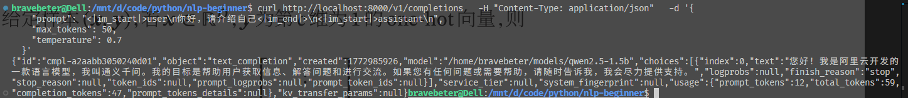

## Task0：
- 使用一张 3090/4090 显卡，使用 vllm 框架部署一个 7B 的模型的 API
    
    - 如果自己的环境显存不够，可以部署更小的模型
        
    - 可以在 /remote-home1/share/models 下寻找自己感兴趣的模型
        
    - 比较使用 vllm 和直接使用 transfromers 进行推理的效率，**并思考其中的原因**
        

## 执行步骤：
1. 准备显卡；
2. 选模型 → 配环境；
3. 用 vLLM 部署 API 并验证；
4. 分别用 vLLM 和 Transformers 跑推理，记录数据；
5. 查资料 / 思考原理，理解 vLLM 的优势。

## 实现过程：
环境：WSL + uv + VsCode，显存RTX3060 6GB
  
1. 使用uv配置环境， 下载vllm、transformers
```bash
uv init
uv add vllm transformers
uv sync
```
2. 使用`download_model`脚本（hugging Face）下载了Qwen/Qwen2.5-1.5B-Instruct到本地。
3. 使用vllm命令运行本地模型，并进行测试
```bash
source .venv/bin/activate # 激活venv环境

# 使用vllm运行启动模型
vllm serve /home/bravebeter/models/qwen2.5-1.5b --gpu-memory-utilization 0.75 --port 8000 --trust-remote-code --max-num-batched-tokens 256 --max-num-seqs 2 --max-model-len 2048 --dtype float16 

# 测试
curl http://localhost:8000/v1/completions \
  -H "Content-Type: application/json" \
  -d '{
    "prompt": "<|im_start|>user\n你好，请介绍自己<|im_end|>\n<|im_start|>assistant\n",
    "max_tokens": 50,
    "temperature": 0.7
  }' 
```
测试执行成功


发送请求后，控制台显示Avg prompt throughput和Avg generation throughput


